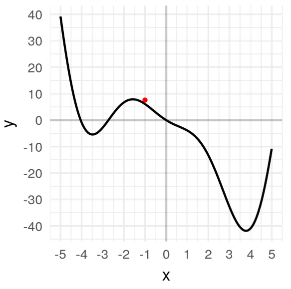
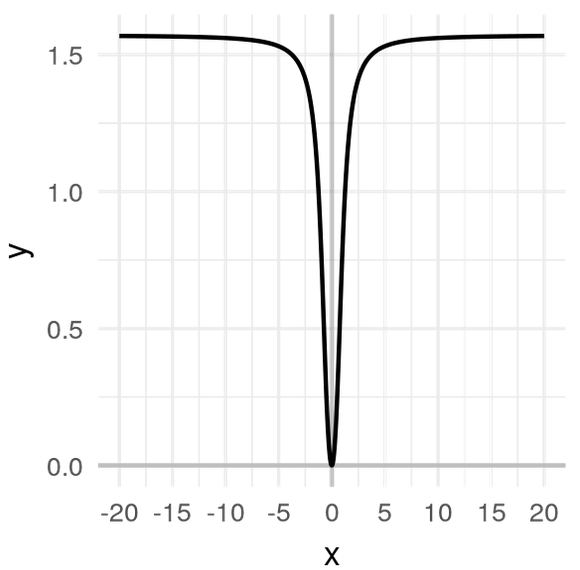

## Universidad Austral de Chile

# INFO133: Base de Datos

### Responsable: Matthieu Vernier, mvernier@inf.uach.cl

La prueba se divide en 2 partes: preguntas y trabajo práctico.

Parte "Preguntas":
- Responderán en una hoja. 
- No podrán consultar internet o documentos, excepto los notas que tomaron en clase.
- Sus respuestas estáran sintéticas. Cuidarán evitar utilizar frases de más de 20 palabras.

Parte "Práctica":
- Desarrollarán un script Python, idealmente utilizando Jupyter Notebook.
- Podrán consultar internet o documentos.
- Enviarán su trabajo en su cuenta GitHub al final de la prueba. 

## 1. Preguntas (4 puntos)

1. ¿Por qué hablamos de datos "estructurados" y datos "no estructurados"?

2. Proponer un diagrama que representa el _workflow_ que seguir para resolver un problema de clasificación utilizando una metodología de aprendizaje supervisado. Su diagrama posicionará al menos los conceptos siguientes: _dataset de entrenamiento_, _dataset de test_, _algoritmo de aprendizaje_, _modelo de clasificación_, _labels_, _features_ (características), _predicciones_, _evaluación del modelo_, _métricas de precisión y recall_, _cross-validación_ o _método de train/test split_.

3. Supongamos que un modelo de clasificación permite obtener la matríz de confusión siguiente:

X | Predicción(A) | Predicción(B) | Predicción(C)
---------------|---------------|---------------|---------------
A | 94 | 16 | 10
B | 21 | 113 | 16
C | 4 | 4 | 92

a- Definir los conceptos de Precisión y Recall
b- Calcular la Precision y el Recall del modelo de clasificación
c- ¿Por qué se considera que la métrica de Precisión mide el "ruido" generado por el modelo, y el Recall mide el "silencio" generado por el modelo?

4. ¿Qué aprenden los algoritmos de Regresión Lineal, Regresión Logística, Árbol de decisión y K-Means? (_Responder indicando el o los conceptos aprendidos por cada uno de los algoritmos_)

5. ¿Cómo aprenden los algoritmos de Regresión Lineal y Regresión Logística? (_Responder utilizando al menos 5 conceptos técnicos_)

6. Describir en una frase (por cada uno) de qué sirven los conceptos siguientes en el contexto de la Regresión Logística: _función de pérdida_, _algoritmo de Gradient Descent_

7. Supongamos que la función siguiente representa la función de pérdida obtenida para resolver un problema de clasificación. Describir etapa por etapa cómo el algoritmo de Gradient Descent podría funcionar? ¿Qué problema podriamos tener?

8. Supongamos ahora que tenemos la función de pérdida siguiente. ¿Qué problema podriamos tener?

9. Supongamos que existe una sociedad distópica que observa en continua el comportamiento de las personas para evaluarlas con una nota. De esta nota depende la obtención de facilidades para poder sobrevivir (reducciones para utilizar transportes públicos, obtención de creditos, obtención de pasaporte, obtención de seguro, obtención de comida, etc.).
- ¿Qué preguntas éticas podrían formular apoyando sus preguntas con conceptos técnicos?

10. Supongamos que existe una sociedad utópica la cual quiere utilizar técnicas de machine learning para mejorar la condición humana.
- ¿Como ingeniero en informática, qué recomendaciones podrían formular a los dirigentes de esta sociedad para evitar que su visión se transforme en distópia?

##.2. Trabajo práctico (2 puntos)

Queremos aprender un modelo de clasificación binario capaz de predecir si va a llover mañana, a partir de datos observables el día anterior.

Tenemos a nuestra disposición un dataset de observaciones de estaciones meteorologícas: [dataset](meteo.csv)

Cada observación está asociada a 24 atributos:
- Date: The date of observation
- Location: The common name of the location of the weather station
- MinTemp: The minimum temperature in degrees celsius
- MaxTemp: The maximum temperature in degrees celsius
- Rainfall: The amount of rainfall recorded for the day in mm
- Evaporation: The so-called Class A pan evaporation (mm) in the 24 hours to 9am
- Sunshine: The number of hours of bright sunshine in the day.
- WindGustDir: The direction of the strongest wind gust in the 24 hours to midnight
- WindGustSpeed: The speed (km/h) of the strongest wind gust in the 24 hours to midnight
- WindDir9am: Direction of the wind at 9am
- WindDir3pm: Direction of the wind at 3pm
- WindSpeed9am: Wind speed (km/hr) averaged over 10 minutes prior to 9am
- WindSpeed3pm: Wind speed (km/hr) averaged over 10 minutes prior to 3pm
- Humidity9am: Humidity (percent) at 9am
- Humidity3pm: Humidity (percent) at 3pm
- Pressure9am: Atmospheric pressure (hpa) reduced to mean sea level at 9am
- Pressure3pm: Atmospheric pressure (hpa) reduced to mean sea level at 3pm
- Cloud9am: Fraction of sky obscured by cloud at 9am. This is measured in "oktas", which are a unit of eigths. It records how many eigths of the sky are obscured by cloud. A 0 measure indicates completely clear sky whilst an 8 indicates that it is completely overcast.
- Cloud3pm: Fraction of sky obscured by cloud (in "oktas": eighths) at 3pm. See Cload9am for a description of the values
- Temp9am: Temperature (degrees C) at 9am
- Temp3pm: Temperature (degrees C) at 3pm
- RainToday: Boolean: 1 if precipitation (mm) in the 24 hours to 9am exceeds 1mm, otherwise 0
- RISK_MM: The amount of next day rain in mm. Used to create response variable RainTomorrow. A kind of measure of the "risk".
- RainTomorrow: The target variable. Did it rain tomorrow?

1) Desarrollar un script python para entrenar y evaluar varios modelos de clasificación, limpiando o transformando los datos si lo estiman necesario.
2) ¿Qué precisión y recall obtiene?
3) ¿Qué variables son buenos predictores?

